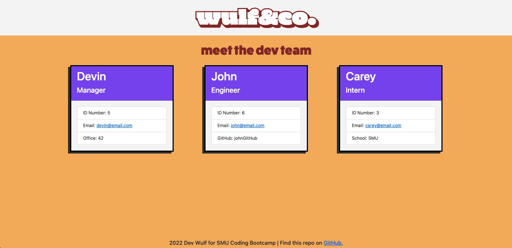

# Dev Team Generator
[](https://opensource.org/licenses/MIT)

## Description

The Dev Team Generator is a Node.js command-line application that recieves a user's input about team members and generates a dynamic web application with the populated information.

## Table of Contents

-   [Installation](#installation)
-   [Usage](#usage)
-   [Testing](#testing)
-   [License](#license)
-   [Questions](#questions)

## Installation

To get started, fork this repo into a text editor, then install the node package into your repo using in the command line.

```bash
npm install
```

Once completed, open the JavaScript file titled `app.js` in the command line by right-clilcking and selecting '*Open in Integrated Terminal*' and enter the following:

```bash
node app.js
```

And that's it! Just follow the prompt in the command line by inputing the information to your project and the HTML page will generate in the folder you assigned the node package to. It's important to note this application can be ran multiple times and will overwrite the generated HTML everytime. Happy Coding!

## Usage



Click the link for a Demo Video:

https://drive.google.com/file/d/1GoaJnLGboXRW5dF-vnOy2FGr4sU0oqDO/view


## Packages/Languages
 Created using Object-Oriented Programming using the following packages:

 
 

 

## License

MIT License

Copyright (c) 2022 Dev Wulf

Permission is hereby granted, free of charge, to any person obtaining a copy
of this software and associated documentation files (the "Software"), to deal
in the Software without restriction, including without limitation the rights
to use, copy, modify, merge, publish, distribute, sublicense, and/or sell
copies of the Software, and to permit persons to whom the Software is
furnished to do so, subject to the following conditions:

The above copyright notice and this permission notice shall be included in all
copies or substantial portions of the Software.

THE SOFTWARE IS PROVIDED "AS IS", WITHOUT WARRANTY OF ANY KIND, EXPRESS OR
IMPLIED, INCLUDING BUT NOT LIMITED TO THE WARRANTIES OF MERCHANTABILITY,
FITNESS FOR A PARTICULAR PURPOSE AND NONINFRINGEMENT. IN NO EVENT SHALL THE
AUTHORS OR COPYRIGHT HOLDERS BE LIABLE FOR ANY CLAIM, DAMAGES OR OTHER
LIABILITY, WHETHER IN AN ACTION OF CONTRACT, TORT OR OTHERWISE, ARISING FROM,
OUT OF OR IN CONNECTION WITH THE SOFTWARE OR THE USE OR OTHER DEALINGS IN THE
SOFTWARE.

## Questions

For questions, contact me via <a href="mailto: devinlwulf@gmail.com">email</a>.

Follow me on <a href="https://github.com/wulfsounds">Github</a>.

-------------------------------------
